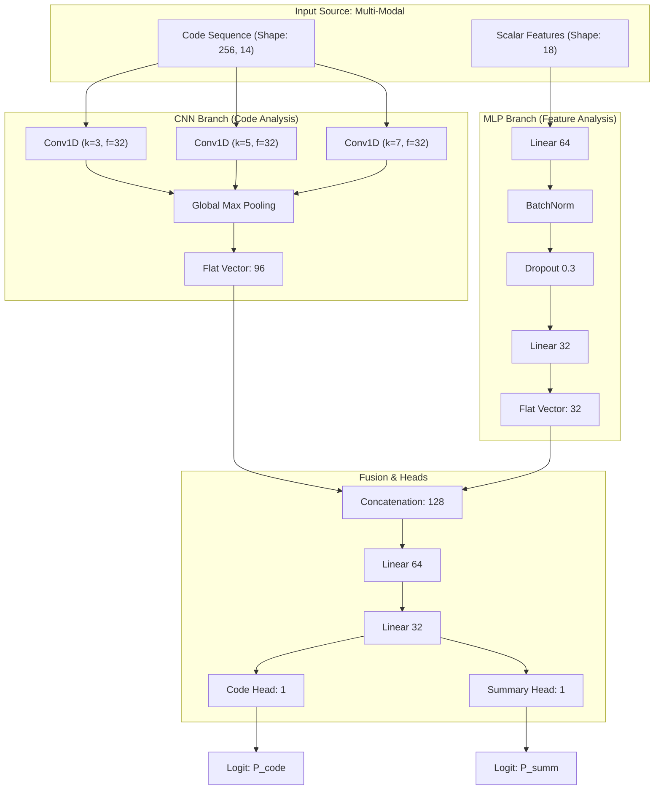

# System Architecture & Pipeline

This document provides a visual and technical overview of the **Unified Trust Metric System**.

---

## 1. System Pipeline
The pipeline handles everything from data ingestion to the final trust score calculation.

```mermaid
graph LR
    subgraph "Data Layer"
    A[Raw Dataset (.xlsx)] --> B[Data Loader]
    B --> C{Synthetic Mutation?}
    C -->|Yes| D[Code/Summary Mutators]
    C -->|No| E[Clean Samples]
    end

    subgraph "Feature Engineering"
    D & E --> F[AST Entity Extraction]
    D & E --> G[Tokenization]
    D & E --> H[Dry-run Execution]
    end

    subgraph "Model Processing"
    G --> I[1D CNN Branch]
    F & H --> J[MLP Branch]
    I & J --> K[Fusion Layer]
    end

    subgraph "Output & Metric"
    K --> L[Hallucination Heads]
    L --> M[P_code & P_summ]
    M --> N[Trust Score Formula]
    end
```

---

## 2. Model Architecture
The `HybridTrustModel` combines structural code analysis with semantic execution features.



---

## 3. High-Level Logic Flow

### Data Augmentation
To train the model on hallucinations, we perform synthetic mutations in [data_loading.py](file:///c:/Unified%20Trust%20Metric%20System/data_loading.py):
- **Code Mutation**: Randomly selects between arg-swapping, operator mutation (+ to -), or line deletion.
- **Summary Mutation**: Injects extrinsic entities or contradicts code logic.

### Trust Score Formula
The final metric is computed as:
$$Trust = w_1(1 - P_{code}) + w_2(1 - P_{summary}) + w_3(S_{api})$$

| Component | Weight | Meaning |
| :--- | :--- | :--- |
| $w_1(1 - P_{code})$ | 0.4 | Reward for code that is likely faithful. |
| $w_2(1 - P_{summary})$ | 0.4 | Reward for summaries that reflect code logic. |
| $w_3(S_{api})$ | 0.2 | Reward for correct structural API usage. |
